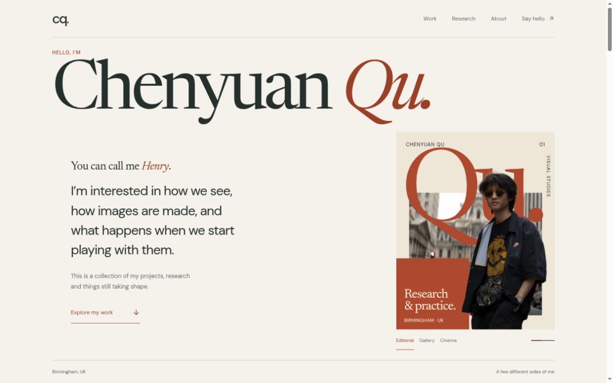

# Chenyuan Qu (Henry) — A personal collection

The source for [chenyuanqu.com](https://chenyuanqu.com): Chenyuan's personal collection of projects, research and things in progress. A warm, visual introduction to the person and the work.



## What is here

- A layered portrait with three poster compositions, manual selection and a discreet pause/resume control
- Selected work with Nexus product imagery and three editable COMPaD poster designs
- A VisualSplit comparison study with published colour editing, lighting and reconstruction examples
- A 360+x panorama that opens inside the scene, with drag and keyboard controls, alongside the complete paper library and citations
- A personal introduction, career and education details, updates and contact routes
- Keyboard navigation, reduced-motion support, native reading without JavaScript and GitHub Pages static export

The site is built with Next.js 14, React, TypeScript, Tailwind CSS, and Framer Motion. Public facts and structured content live in `src/data/site.ts`; source provenance is tracked in `docs/sources.md`.

## Local development

Use the repository's Node version, install dependencies, and start the development server:

```bash
nvm use
npm install
npm run dev
```

Open [http://localhost:3000](http://localhost:3000).

## Validate and export

```bash
npm run lint
npm run typecheck
npm run build
npm run test:e2e
```

`npm run build` writes the deployable static site to `out/`. To inspect that export locally, run `npm run preview:out` and open [http://localhost:4173](http://localhost:4173).

For a project-site preview, set both public URL values before building:

```bash
NEXT_PUBLIC_BASE_PATH=/project-preview \
NEXT_PUBLIC_SITE_URL=https://example.com \
npm run build
```

## Contact

For research, technology, or collaboration enquiries, email [Chenyuan.Qu@outlook.com](mailto:Chenyuan.Qu@outlook.com).
