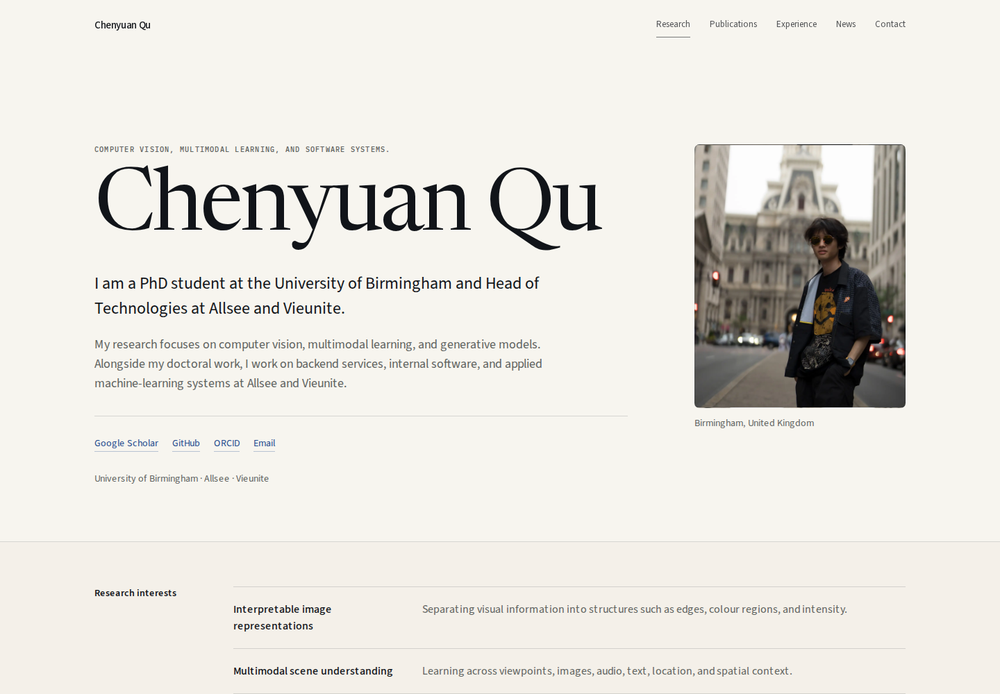

# Chenyuan Qu — Personal Academic Website

The source for [chenyuanqu.com](https://chenyuanqu.com): a personal academic website for Chenyuan Qu, a PhD student working on computer vision, multimodal learning, and generative models.



## What is here

- Selected research projects with original figures and an accessible high-resolution viewer
- A complete publication list with media, citation, and BibTeX tools
- Research appointments, industry experience, education, news, and contact details
- Responsive, keyboard-accessible interaction and GitHub Pages static export

The site is built with Next.js 14, React, TypeScript, Tailwind CSS, and Framer Motion. Public facts and structured content live in `src/data/site.ts`; source provenance is tracked in `docs/sources.md`.

## Local development

Use the repository's Node version, install dependencies, and start the development server:

```bash
nvm use
npm install
npm run dev
```

Open [http://localhost:3000](http://localhost:3000).

## Validate and export

```bash
npm run lint
npm run typecheck
npm run build
npm run test:e2e
```

`npm run build` writes the deployable static site to `out/`. To inspect that export locally, run `npm run preview:out` and open [http://localhost:4173](http://localhost:4173).

For a project-site preview, set both public URL values before building:

```bash
NEXT_PUBLIC_BASE_PATH=/project-preview \
NEXT_PUBLIC_SITE_URL=https://example.com \
npm run build
```

## Contact

For research, technology, or collaboration enquiries, email [Chenyuan.Qu@outlook.com](mailto:Chenyuan.Qu@outlook.com).
